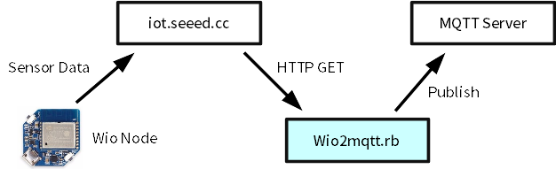

wio2mqtt
====

Wio Node
  * http://www.seeedstudio.com/wiki/Wio_Node
  * http://www.seeedstudio.com/item_detail.html?p_id=2637

How to use
----

    $ mkdir ~/work/
    $ cd work
    $ git clone https://github.com/yoggy/wio2mqtt.git
    $ cd wio2mqtt
    $ cp mqtt_config.yaml.sample mqtt_config.yaml
    $ vi mqtt_config.yaml
    
        mqtt_host:     mqtt.example.com
        mqtt_port:     1883
        mqtt_username: username
        mqtt_password: password
    
    $ cp wio_config.yaml.sample wio_config.yaml
    $ vi wio_config.yaml

        - access_token: please_replace_to_your_access_talken
          src_type:     analog_in
          dst_topic:    home_cds
          dst_key:      cds
        - access_token: please_replace_to_your_access_talken
          src_type:     dht11_humidity
          dst_topic:    home_dht11
          dst_key:      humidity
        - access_token: please_replace_to_your_access_talken
          src_type:     dht11_temperature
          dst_topic:    home_dht11
          dst_key:      temperature
    
    $ ruby wio2mqtt.rb

for supervisord
----

    $ cd ~/work/wio2mqtt/
    $ sudo cp wio2mqtt.conf.sample /etc/supervisor/conf.d/wio2mqtt.conf
    $ sudo vi /etc/supervisor/conf.d/wio2mqtt.conf
      (fix path, etc...)
    $ sudo supervisorctl reread
    $ sudo supervisorctl add wio2mqtt
    $ sudo supervisorctl status
    wio2mqtt                  RUNNING    pid 8192, uptime 0:00:30

Copyright and license
----
Copyright (c) 2016 yoggy

Released under the [MIT license](LICENSE.txt)
